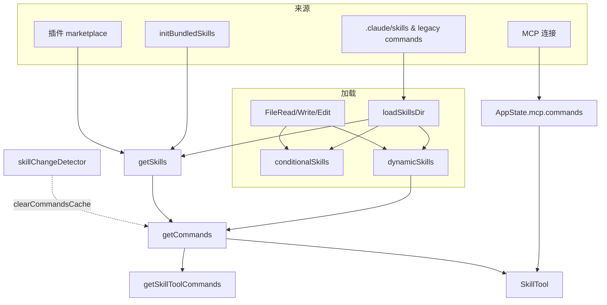

# Skill 加载全链路

从启动注册到模型调用的完整路径。

---

## 主流程

```
                        ┌─────────────────────────────────┐
                        │          启动阶段                │
                        │  initBundledSkills (内存注册)     │
                        │  getCommands (扫盘 → 聚合)       │
                        └──────────────┬──────────────────┘
                                       │
         ┌─────────────────────────────┼─────────────────────────────┐
         │                             │                             │
         ▼                             ▼                             │
┌─────────────────┐          ┌─────────────────┐          ┌─────────────────┐
│   静态技能       │          │   动态发现       │          │   外部来源       │
│                 │          │                 │          │                 │
│ • bundledSkills │          │ • 目录扫描       │          │ • MCP 连接       │
│ • skillDir      │          │ • 条件激活       │          │ • 插件 marketplace│
│ • legacy        │          │   ↓             │          │                 │
│                 │          │ dynamicSkills   │          │                 │
└────────┬────────┘          └────────┬────────┘          └────────┬────────┘
         │                            │                            │
         └────────────────────────────┼────────────────────────────┘
                                      │
                                      ▼
                        ┌─────────────────────────────────┐
                        │       聚合中枢 (getCommands)      │
                        │  7 级优先级合并 + 去重 + 过滤     │
                        └──────────────┬──────────────────┘
                                       │
                          ┌────────────┼────────────┐
                          │            │            │
                          ▼            ▼            ▼
                   ┌──────────┐ ┌──────────┐ ┌──────────┐
                   │ 用户调用  │ │ 模型调用  │ │ 热更新   │
                   │ /command │ │ SkillTool│ │ chokidar │
                   └────┬─────┘ └────┬─────┘ └────┬─────┘
                        │            │            │
                        ▼            ▼            │
                   ┌─────────────────────────┐    │
                   │      SkillTool 执行      │    │
                   │                         │    │
                   │  权限检查 → 执行路径选择  │    │
                   │    ├─ remote (远程)      │    │
                   │    ├─ fork (子 agent)    │◄───┘
                   │    └─ inline (展开prompt)│  清缓存 → 重新合并
                   └─────────────────────────┘
```

**核心链路**：定义 → 注册 → 扫盘 → 聚合 → 发现 → 执行，每一步有独立的缓存和失效机制。

---

## 1. 启动阶段（main.tsx）

```
main.tsx
  ├─ initBuiltinPlugins()           ← 内置插件（同步，内存注册）
  ├─ initBundledSkills()            ← 内置技能（同步，内存注册）
  ├─ getCommands(cwd)                ← 首次加载，与 setup 并行
  └─ skillChangeDetector.initialize() ← chokidar 监听磁盘变更
```

内置技能和内置插件**先于** `getCommands` 注册进内存，保证后续 `getSkills()` 能同步读到。

### 1.1 内置技能分类

内置技能通过 `initBundledSkills` 统一注册，分为两类：

- **核心技能**：始终注册，如 `update-config`（配置 settings 各项设置）、`batch`（批量文件处理）等
- **Feature-gated 技能**：在对应 feature flag 启用时才注册，如 `loop`、`schedule` 等

```js
export function initBundledSkills(): void {
  // 核心技能
  registerUpdateConfigSkill()
  registerBatchSkill()
  // ...

  // Feature-gated 技能
  if (feature('KAIROS') || feature('KAIROS_DREAM')) {
    const { registerDreamSkill } = require('./dream.js')
    registerDreamSkill()
  }
}
```

核心技能无条件可用；Feature-gated 技能通过 `feature()` 调用与 GrowthBook 远程配置联动，支持灰度发布和动态开关。

### 1.2 注册 API：BundledSkillDefinition

`registerBundledSkill` 接收一个 `BundledSkillDefinition` 对象，完整类型如下：

```ts
export type BundledSkillDefinition = {
  /** 技能唯一标识名（命令名），与 Slash 命令、遥测与解压目录名等关联 */
  name: string
  /** 面向模型与 UI 的简短说明 */
  description: string
  /** 可选别名列表 */
  aliases?: string[]
  /** 可选「何时使用」引导文案，帮助模型路由与工具选择 */
  whenToUse?: string
  /** 可选参数占位/用法提示 */
  argumentHint?: string
  /** 本技能执行时允许模型使用的工具名白名单；未列出则不可用 */
  allowedTools?: string[]
  /** 可选模型标识；未设置则沿用全局或默认模型 */
  model?: string
  /** 若为 true，禁止模型未经用户触发自动调用本技能 */
  disableModelInvocation?: boolean
  /** 若为 false，技能对 UI 隐藏；默认可用户调用 */
  userInvocable?: boolean
  /** 可选：动态判断是否启用；返回 false 则当前环境不可用 */
  isEnabled?: () => boolean
  /** 可选：附随本技能的 Hooks 配置（与项目级 hooks 相同语义） */
  hooks?: HooksSettings
  /** 执行上下文：`inline` 在当前会话内串联执行；`fork` 在独立子上下文运行 */
  context?: 'inline' | 'fork'
  /** 可选：指定承接该技能任务的子 agent 配置标识 */
  agent?: string
  /** 首次调用时需解压到磁盘的附加参考文件映射。设置后会在技能提示前插入基目录行 */
  files?: Record<string, string>
  /** 根据用户参数与会话上下文异步生成发给模型的内容块序列，是技能的核心载荷逻辑 */
  getPromptForCommand: (
    args: string,
    context: ToolUseContext,
  ) => Promise<ContentBlockParam[]>
}
```

**关键字段解读**：

| 字段 | 作用 | 设计意图 |
|------|------|----------|
| `getPromptForCommand` | 延迟执行的 prompt 生成器 | 在被调用时才运行，避免启动时不必要的计算 |
| `context: 'fork'` | 标记在独立子进程中运行 | 隔离主对话状态，避免技能执行污染主 session 上下文 |
| `isEnabled` | 每次调用时检查功能是否开启 | 与 GrowthBook feature flag 联动，支持动态开关和灰度 |
| `files` | 引用文件集合，首次调用时提取到磁盘 | 技能可附带参考文件，模型通过 Read/Grep 按需访问 |
| `whenToUse` | 向模型说明何时应优先选用 | 直接影响 SkillTool 的路由选择，控制模型自动调用时机 |
| `disableModelInvocation` | 禁止模型自主调用 | 仅允许用户显式触发（/命令），防止模型误用 |
| `allowedTools` | 工具白名单 | 限制技能运行时的权限边界，防止越权操作 |

### 1.3 磁盘技能 vs 内置技能

| 维度 | 磁盘技能（SKILL.md） | 内置技能（BundledSkillDefinition） |
|------|----------------------|-------------------------------------|
| 定义方式 | Markdown frontmatter + 正文 | TypeScript 对象 |
| 注册时机 | 启动扫描 + 热更新 | `initBundledSkills()` 同步注册 |
| 动态开关 | 靠 `paths` 条件 + `isEnabled` 字段 | 靠 `isEnabled` 回调 + feature flag |
| 附加文件 | 技能目录下的所有文件 | `files` 字段指定，首次调用时解压 |
| 适用场景 | 用户/项目自定义技能 | 系统级、编译期内置技能 |

两种技能的后半段链路（执行、热更新、缓存）完全统一，只是来源和注册 API 不同。

---

## 2. 聚合中枢（commands.ts）

### 2.1 getSkills(cwd)

四路来源**并行**加载（失败单路返回 `[]`，不拖垮整体）：

```
getSkills(cwd)
  ├─ getSkillDirCommands(cwd)        ← 磁盘（managed / user / project / --add-dir / legacy）
  ├─ getPluginSkills()               ← 插件 marketplace
  ├─ getBundledSkills()              ← 内置（同步读内存数组）
  └─ getBuiltinPluginSkillCommands() ← 内置插件（同步读内存）
```

### 2.2 loadAllCommands(cwd) — memoize by cwd

合并优先级从高到低：

```
1. bundledSkills          ← 编译期内置
2. builtinPluginSkills    ← 内置插件
3. skillDirCommands       ← 磁盘
4. workflowCommands       ← workflow 脚本（feature flag）
5. pluginCommands         ← 插件命令
6. pluginSkills           ← 插件技能
7. COMMANDS()             ← 内置 /help、/clear 等（memoize）
```

### 2.3 getCommands(cwd) — 对外主入口，不 memoize

```
loadAllCommands(cwd)
  → 过滤 meetsAvailabilityRequirement + isCommandEnabled
  → 插入 dynamicSkills（排在 plugin skills 之后、built-in 之前）
  → 返回
```

动态技能插入位置在插件和内置之间，保证同名时用户/项目技能优先于内置。

### 2.4 模型可见列表

| 函数 | 用途 | memoize |
|------|------|---------|
| `getSkillToolCommands(cwd)` | SkillTool 可选列表 | 是 |
| `getSlashCommandToolSkills(cwd)` | `/skills` 展示列表 | 是 |

过滤逻辑：`type === 'prompt'`、`!disableModelInvocation`、`source !== 'builtin'`，且必须有 `whenToUse` 或用户描述。列表有字符预算（`SkillTool/prompt.ts`），避免占满上下文。

---

## 3. 磁盘加载（loadSkillsDir.ts）

### 3.1 getSkillDirCommands(cwd) — memoize

**加载来源**（按目录优先级）：

```
managed policy 目录 → ~/.claude/skills → 项目链 .claude/skills → --add-dir → legacy .claude/commands
```

**各来源详情**：

| 层级 | 路径 | 说明 |
|------|------|------|
| 管理策略级 | `{managedPath}/.claude/skills/` | 企业管理员通过集中配置下发；可通过 `CLAUDE_CODE_DISABLE_POLICY_SKILLS` 环境变量禁用 |
| 用户级 | `~/.claude/skills/` | 跨所有项目可用，个人自定义技能 |
| 项目级 | `<project>/.claude/skills/` | 仅在该目录上下文中生效；支持嵌套目录发现，沿目录链向上查找 |
| 额外目录 | `--add-dir` CLI 参数指定 | 启动时显式注入的外部技能目录 |
| 旧版目录 | `.claude/commands/` | 兼容旧格式，自动转换 |

通过 `realpath` 解析后按文件路径去重，防止符号链接或重叠父目录导致的重复加载。

**每个来源的流程**：

```
loadSkillsFromSkillsDir(basePath)
  ├─ 扫描 <name>/SKILL.md（不支持平铺 .md）
  ├─ parseFrontmatter → parseSkillFrontmatterFields → createSkillCommand
  └─ 返回 SkillWithPath[]
```

**去重**：全部结果按 `realpath` 去重，同源文件只保留先出现的。

**条件技能分离**：frontmatter 含 `paths` 字段的技能 → 进 `conditionalSkills` Map，**不出现在** `getSkillDirCommands` 的返回值中。等文件操作触发路径匹配后，再激活移入 `dynamicSkills`。

**`--bare` 模式**：跳过自动发现，仅加载 `--add-dir` 显式指定的目录。

### 3.2 Legacy commands 目录

`loadSkillsFromCommandsDir` 处理 `.claude/commands/`：

- 支持 `subdir/SKILL.md`（父目录名作技能名）和 `plain.md`（文件名作技能名）
- `transformSkillFiles`：若目录内有 `SKILL.md`，只取它，忽略同目录其他 `.md`
- `buildNamespace`：支持 `subdir:command` 命名空间格式

### 3.3 createSkillCommand — 生成 getPromptForCommand

```typescript
getPromptForCommand():
  1. 注入 "Base directory for this skill: {baseDir}"
  2. 替换 $ARGUMENTS
  3. 替换 ${CLAUDE_SKILL_DIR}、${CLAUDE_SESSION_ID}
  4. 执行内联 shell (!... 语法)
  5. 注入 allowedTools 到权限上下文
```

### 3.4 MCP 桥接

模块末尾 `registerMCPSkillBuilders({ createSkillCommand, parseSkillFrontmatterFields })`，供 `mcpSkillBuilders.ts` 取用。这个间接层避免 `loadSkillsDir.ts`（依赖图巨大）与 MCP client 代码形成循环 import。

---

## 4. 动态发现

用户操作文件时，三个文件工具触发动态扫描：

```
FileRead / FileWrite / FileEdit
  ├─ discoverSkillDirsForPaths(filePaths, cwd)
  │     └─ 从文件父目录向上走到 cwd，收集 .claude/skills
  │        跳过已检查目录 (dynamicSkillDirs Set)
  │        跳过 gitignored 目录
  │        返回深度优先排序
  ├─ addSkillDirectories(dirs)
  │     └─ loadSkillsFromSkillsDir → 合并进 dynamicSkills Map
  │        反向处理（浅层先入，深层覆盖）
  │        触发 skillsLoaded.emit()
  └─ activateConditionalSkillsForPaths(filePaths, cwd)
        └─ ignore 库做 gitignore 风格匹配
          命中 → conditionalSkills → dynamicSkills
          记录到 activatedConditionalSkillNames（本会话不再重复激活）
```

回调链：

```
skillsLoaded.emit()
  → onDynamicSkillsLoaded 回调（skillChangeDetector 注册）
    → clearCommandMemoizationCaches()  ← 只清 memo，不动 dynamicSkills Map
```

### 4.1 条件技能

除了目录级动态发现，Skill 还支持**文件级精确匹配**的条件激活机制。

**定义阶段**：frontmatter 含 `paths` 字段的技能在 `loadSkillsDir` 阶段**不直接激活**，而是存入 `conditionalSkills` Map：

```
SKILL.md 示例：
---
name: my-skill
paths:
  - "*.tsx"
  - "src/components/**"
---
```

**激活流程**：

```
文件操作（Read / Write / Edit）
  │
  ├─ activateConditionalSkillsForPaths(filePaths, cwd)
  │     │
  │     ├─ 遍历所有 conditionalSkills
  │     ├─ 用 ignore 库做 gitignore 风格匹配
  │     │     命中 → 技能从 conditionalSkills 移入 dynamicSkills
  │     │     记录到 activatedConditionalSkillNames
  │     │
  │     └─ 已激活的技能本会话内不再重复激活
  │
  └─ dynamicSkills 中的技能会在 getCommands() 时合并到可用列表
```

**匹配规则**：
- `paths` 支持 gitignore 风格的 glob 模式（`*.tsx`、`src/**` 等）
- 匹配的是模型操作的文件路径（相对于 cwd）
- 命中任一 pattern 即激活，永久有效（本会话）

**典型场景**：项目中有按文件类型定制的 code review 规则、lint 修复流程等技能，平时不可见不占上下文，只在模型实际触碰对应文件时才出现。

### 4.2 dynamicSkills Map

`dynamicSkills` 是**会话运行时**的动态技能容器，容纳启动后通过文件操作触发的所有新增技能。

**来源**：技能进入 `dynamicSkills` 有两条路径：

```
文件操作（Read / Write / Edit）
  │
  ├─ 目录发现
  │     discoverSkillDirsForPaths → addSkillDirectories → dynamicSkills
  │
  └─ 条件激活
        conditionalSkills → activateConditionalSkillsForPaths → dynamicSkills
```

**在命令合并中的位置**：

```
getCommands() 合并顺序：
  bundledSkills → builtinPluginSkills → skillDirCommands → pluginSkills → dynamicSkills → COMMANDS()
```

排在插件技能之后、内置命令之前，保证同名时动态发现的用户/项目技能优先于内置技能。

**生命周期对比**：

| 存储 | 初始化 | 清除触发 | 说明 |
|------|--------|----------|------|
| `dynamicSkills` Map | 空，会话启动时无内容 | **永不清除**，随会话累积 | 只增不减，直到会话结束 |
| `conditionalSkills` Map | 启动扫盘时填入 | `clearSkillCaches()`（热更新时） | 每次扫盘重建，不含已激活项 |
| `getSkillDirCommands` memo | 首次调用时填入 | `clearSkillCaches()`（热更新时） | 磁盘扫描结果的缓存 |

`clearCommandMemoizationCaches()` 只清 memo 层，不动 `dynamicSkills` Map。这意味着动态发现的技能在热更新后仍然可用，只有重启会话才会消失。

## 5. SkillTool 执行

```
SkillTool.call({ skill, args })
  ├─ getAllCommands(context)
  │     └─ getCommands(cwd) + AppState.mcp.commands (loadedFrom === 'mcp')
  │        按名去重
  ├─ 权限检查 → 允许/拒绝/询问用户
  └─ 执行路径
        ├─ 远程 canonical skill → executeRemoteSkill()
        ├─ context === 'fork' → executeForkedSkill() 子 agent
        └─ 默认 → processPromptSlashCommand() → 展开 skill prompt + contextModifier
```

MCP 技能**不在** `getCommands()` 的默认结果中，而是在 `SkillTool.getAllCommands` 点才合并进列表。

---

## 6. 热更新

```
chokidar (depth: 2, awaitWriteFinish: 1000ms)
  → 防抖 300ms
  → ConfigChange hook ('skills')
  → clearSkillCaches()         ← 清 getSkillDirCommands memo + conditionalSkills
  → clearCommandsCache()       ← 清所有 memo + 插件
  → resetSentSkillNames()
  → skillsChanged.emit()

useSkillsChange hook 订阅 → getCommands(cwd) → 更新 REPL store
```

GrowthBook 刷新时仅 `clearCommandMemoizationCaches()`，不动磁盘缓存。

---

## 7. 缓存层级

| 缓存 | 清除触发 |
|------|----------|
| `loadAllCommands` memo | 磁盘变更、插件重载 |
| `getSkillDirCommands` memo | 磁盘变更、`clearSkillCaches()` |
| `getPluginSkills` memo | 插件重载 |
| `getSkillToolCommands` memo | `clearCommandMemoizationCaches()` |
| `dynamicSkills` Map | 永不清除（随会话累积） |
| `conditionalSkills` Map | `clearSkillCaches()` |
| `dynamicSkillDirs` Set | 不清除（避免重复 stat） |
| `activatedConditionalSkillNames` Set | `clearSkillCaches()` |

关键区分：`clearCommandMemoizationCaches()` 清 memo 层但不动磁盘和动态技能；`clearCommandsCache()` 额外清插件和 `clearSkillCaches()`，触发全量扫盘。

---

## 8. 端到端数据流



---

## 9. 主要文件

| 主题 | 路径 |
|------|------|
| 聚合中枢、命令合并 | `src/commands.ts` |
| 磁盘加载、动态发现、条件技能 | `src/skills/loadSkillsDir.ts` |
| MCP 构建函数桥接 | `src/skills/mcpSkillBuilders.ts` |
| 内置技能注册 | `src/skills/bundledSkills.ts`、`src/skills/bundled/index.ts` |
| 内置插件注册 | `src/plugins/builtinPlugins.ts` |
| 插件技能加载 | `src/utils/plugins/loadPluginCommands.ts` |
| Skill 工具执行 | `src/tools/SkillTool/SkillTool.ts`、`prompt.ts` |
| 文件监听 | `src/utils/skills/skillChangeDetector.ts` |
| UI 刷新 | `src/hooks/useSkillsChange.ts` |
| 文件工具触发发现 | `src/tools/FileReadTool`、`FileWriteTool`、`FileEditTool` |

---

*以 `origin/src` 实际实现为准。*
