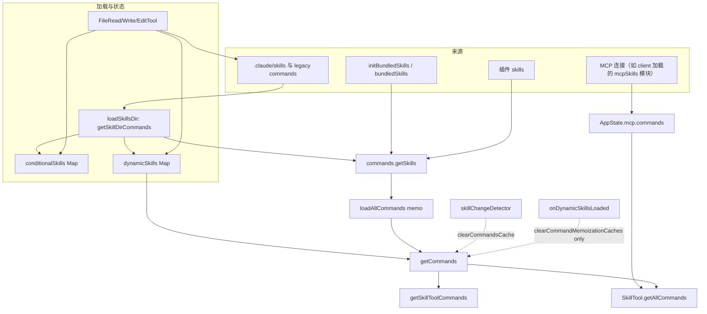

# Skill 文件处理全链路说明

本文梳理 `origin/src` 中**技能（Skill）**从磁盘/内置/MCP 到进入命令列表、再被模型或用户触发的端到端路径，便于查阅模块边界与缓存失效点。

---

## 1. 技能在系统里的形态

- **磁盘技能（标准路径）**：`.claude/skills/<技能名>/SKILL.md`（仅支持「目录 + SKILL.md」，不按该结构无法在 `/skills` 目录树内单文件注册）。
- **Legacy 命令目录**：`.claude/commands/` 下的 `skill.md`（大小写不敏感）或普通 `.md`；`SKILL.md` 存在时以**父目录名**为技能名，并与同目录其他 md 做合并/取舍（见 `transformSkillFiles`）。
- **内置技能（Bundled）**：不读用户磁盘，在启动时通过 `registerBundledSkill` 注册进内存表（可选带 `files` 首次调用时解压到进程临时根目录）。
- **插件技能**：由插件体系加载，与目录技能一起在 `commands.ts` 的 `getSkills` 中合并。
- **MCP 技能**：由 MCP 连接发现，`loadedFrom === 'mcp'`，**不进入** `getCommands()` 的默认合并结果，而是通过 `AppState.mcp.commands` 维护；在 **Skill 工具**等场景下再与本地列表合并。

统一对外类型为 `Command`（`type: 'prompt'` 等），含 `name`、`description`、`whenToUse`、`allowedTools`、`hooks`、`paths`（条件激活）、`getPromptForCommand` 等字段。

---

## 2. 启动阶段：内置技能 + 侧向加载预热

| 步骤 | 位置 | 行为 |
|------|------|------|
| 注册内置技能 | `main.tsx` → `initBundledSkills()` → `skills/bundled/index.ts` | 按特性开关调用各 `registerXxxSkill()`，最终落入 `bundledSkills.ts` 内部数组 |
| 开启目录监听 | `main.tsx` → `skillChangeDetector.initialize()` | `utils/skills/skillChangeDetector.ts`：chokidar 监视用户/项目等下的 `.claude/skills` 与 `.claude/commands` |
| 预热命令（可选） | `setup.ts` 等 | `void getCommands(getProjectRoot())` 触发首次 expensive 加载 |

**内置技能与磁盘技能来源独立**：内置在 `getBundledSkills()` 同步读取；磁盘/插件在 `getSkillDirCommands(cwd)` 等异步路径中读取。

---

## 3. 聚合中枢：`commands.ts`

### 3.1 `getSkills(cwd)`（内部）

并行加载：

1. `getSkillDirCommands(cwd)` ← **`skills/loadSkillsDir.ts`**（托管 / 用户 / 项目 / `--add-dir` / legacy `commands`）
2. `getPluginSkills()` ← 插件
3. `getBundledSkills()` ← 内置（同步）
4. `getBuiltinPluginSkillCommands()` ← 内置插件带的技能

失败单路分支记日志并返回 `[]`，不拖垮整体。

### 3.2 `loadAllCommands(cwd)`（memoize）

合并顺序（大致体现优先级思想，具体去重还在后序步骤）：

```text
bundledSkills
→ builtinPluginSkills
→ skillDirCommands（磁盘 + legacy）
→ workflowCommands
→ pluginCommands
→ pluginSkills
→ COMMANDS()（内置 slash 命令表，含 /skills 等）
```

### 3.3 `getCommands(cwd)`（对外主入口）

1. `await loadAllCommands(cwd)`
2. 读取 **`getDynamicSkills()`**（会话中动态发现 + 条件激活后写入的 map）
3. 过滤：`meetsAvailabilityRequirement` + `isCommandEnabled`
4. 将**不与基类重名**的动态技能插入到「内置 COMMANDS 条目之前」的槽位，保证展示/合并顺序一致

### 3.4 缓存清理

| API | 作用 |
|-----|------|
| `clearCommandMemoizationCaches()` | 只清 `loadAllCommands` / `getSkillToolCommands` / `getSlashCommandToolSkills` 等 memo；**不清** `loadSkillsDir` 的条件/动态技能状态 |
| `clearCommandsCache()` | 在上述基础上 + `clearSkillCaches()` + 插件相关 cache → **全量重新扫盘** |

动态技能加载回调里**只能** `clearCommandMemoizationCaches()`，否则会把刚写入的 `dynamicSkills` 一并清掉（见 `skillChangeDetector` 内对 `onDynamicSkillsLoaded` 的注释）。

---

## 4. 磁盘加载细节：`skills/loadSkillsDir.ts`

### 4.1 `getSkillDirCommands`（memoize）

- **来源**：托管策略目录、用户 `~/.claude/skills`、沿项目链路的 `.claude/skills`、`--add-dir` 衍生路径、legacy `.claude/commands`。
- **解析**：读 `SKILL.md` → `parseFrontmatter` → **`parseSkillFrontmatterFields`**（与 MCP 共用字段逻辑）→ **`createSkillCommand`**（生成 `getPromptForCommand`：占位符、`${CLAUDE_SKILL_DIR}`、`${CLAUDE_SESSION_ID}`、非 MCP 时的内联 shell 等）。
- **去重**：对解析到的路径做 `realpath`，同源文件只保留先出现的一份。
- **条件技能**：frontmatter 里 `paths` 非全局匹配时，技能先进入 `conditionalSkills` Map，**不会**出现在 `getSkillDirCommands` 的即时返回值里；待路径匹配后再激活（见下文）。
- **`--bare` / 策略**：可跳过自动发现，仅保留显式 `--add-dir` 等策略允许的来源（代码内均有分支与日志）。

### 4.2 会话中动态发现

- **`discoverSkillDirsForPaths(filePaths, cwd)`**：从被操作文件的目录**向上**走到 `cwd`（不含 cwd 顶层的 `.claude/skills`，因启动已加载），收集存在的 `.claude/skills`；可因 gitignore 跳过；返回目录列表**深度优先**（深层优先）。
- **`addSkillDirectories(dirs)`**：对各目录调用 `loadSkillsFromSkillsDir`，合并进 `dynamicSkills` Map；后发/深层覆盖同名；最后 `skillsLoaded.emit()`。
- **`activateConditionalSkillsForPaths(filePaths, cwd)`**：用 `ignore` 库做 gitignore 风格匹配，将命中的条件技能从 `conditionalSkills` 移入 `dynamicSkills` 并打点、emit。

### 4.3 与文件工具的挂钩

以下工具在读写/编辑文件后会触发「发现目录 + 条件激活」（避免嵌套子目录技能直到触达相关路径才出现）：

- `tools/FileReadTool/FileReadTool.ts`
- `tools/FileWriteTool/FileWriteTool.ts`
- `tools/FileEditTool/FileEditTool.ts`

典型调用顺序：`discoverSkillDirsForPaths` → `addSkillDirectories` → `activateConditionalSkillsForPaths`。

### 4.4 MCP 构建函数注册

模块末尾 **`registerMCPSkillBuilders({ createSkillCommand, parseSkillFrontmatterFields })`**，供 MCP 侧通过 **`skills/mcpSkillBuilders.ts`** 取用，避免与 `client` 形成巨大 import 环，并兼容 Bun 打包路径（详见该文件注释）。

---

## 5. 暴露给模型：Skill 工具与列表预算

### 5.1 `getSkillToolCommands(cwd)`（memoize）

基于 `getCommands(cwd)` 再过滤：

- `type === 'prompt'` 且未 `disableModelInvocation`
- `source !== 'builtin'`
- 满足「bundled / skills / legacy commands / 有用户描述或 whenToUse」等条件

用于系统提示或工具描述里的**可发现技能列表**；列表正文有字符预算（见 `tools/SkillTool/prompt.ts`），避免占满上下文。

### 5.2 `SkillTool` 执行路径（概要）

- `tools/SkillTool/SkillTool.ts`：通过 **`getAllCommands(context)`** 合并 **`getCommands(projectRoot)`** 与 **`AppState.mcp.commands` 中 `loadedFrom === 'mcp'` 的 prompt**，再按名查找并执行 `getPromptForCommand`。
- 内置 fork 子代理、权限、遥测、实验性远程技能搜索等与执行链交叉，不在此展开。

---

## 6. 热更新：`skillChangeDetector` + React

- **磁盘变更**：chokidar → 防抖 →（可选）ConfigChange hook → `clearSkillCaches()` + `clearCommandsCache()` + `resetSentSkillNames()` → `skillsChanged.emit()`。
- **UI**：`hooks/useSkillsChange.ts` 订阅 `skillChangeDetector`，全量清缓存并 `getCommands`；GrowthBook 刷新时仅 `clearCommandMemoizationCaches()` 以刷新 `isEnabled()` 类门控。

---

## 7. 遥测与使用统计

- 启动可用技能：`utils/telemetry/skillLoadedEvent.ts` → `logSkillsLoaded`
- 使用频次：`utils/suggestions/skillUsageTracking.ts` → `recordSkillUsage` / `getSkillUsageScore`（防抖写全局配置 + 7 天半衰）

---

## 8. 端到端数据流（简图）



---

## 9. 查阅索引（主要文件）

| 主题 | 路径 |
|------|------|
| 目录加载、条件/动态技能、frontmatter | `src/skills/loadSkillsDir.ts` |
| MCP 构建函数注册表 | `src/skills/mcpSkillBuilders.ts` |
| 内置技能注册 | `src/skills/bundledSkills.ts`、`src/skills/bundled/index.ts` |
| 命令合并与 Skill 列表过滤 | `src/commands.ts` |
| Skill 工具与列表预算 | `src/tools/SkillTool/SkillTool.ts`、`src/tools/SkillTool/prompt.ts` |
| 文件监听 | `src/utils/skills/skillChangeDetector.ts` |
| UI 刷新 | `src/hooks/useSkillsChange.ts` |
| 文件工具触发发现 | `src/tools/FileReadTool/...`、`FileWriteTool`、`FileEditTool` |
| Markdown 与 legacy 扫描辅助 | `src/utils/markdownConfigLoader.ts` |

---

*文档随代码演进可能过时；以 `origin/src` 实际实现为准。*
